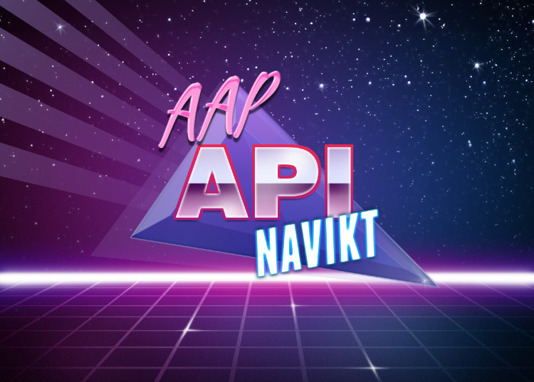

#API
API for henting av informasjon om AAP.

# Nyttige lenker
[Altinn doc](https://altinn.github.io/docs/utviklingsguider/samtykke/datakilde/opprett-tjeneste/)
[Altinn dev](https://tt02.altinn.no/)

[NAV API portal GitHub](https://github.com/navikt/nav-api-portal)
[NAV API portal dev](https://api-portal-preprod.nav.no/integrasjonsguide/altinn)
[TP grensesnitt](https://navno-my.sharepoint.com/:w:/g/personal/nina_annette_hongseth_nav_no/EcKE0NEmaFFPgGFI3Yg02WwBZEjRZmIv3whX9uioMj1IEw)
[TP meldekort](https://navno-my.sharepoint.com/:w:/g/personal/nina_annette_hongseth_nav_no/EXK14CVsWCtEvs-EXekU2vIBhFwAVkHRj4_8bWVQ3XSFVw)

# Innsikt
### DSOP (Digital Samhandling Offentlig Privat)
Arena tilbyr et ekstenrt API i dag som forsikringsselskaper bruker (dnb, sparebank1, gjensidige, nordea, var det en til? ikke alle er i prod enda)

Det tar imot 2 tokens:
* et provisjonert av Maskinporten (verifiser innlogget system, f.eks DNB)
* et provisjonert av Alltinn (med detaljer om samtykke fra bruker)

https://api-portal.nav.no/

Vi må ta i mot denne trafikken, delegere mot ny vedtaksløsning eller gammel (arena)
I dag spør de APIet periodisk (1 gang per mnd?)
De ønsker seg hendelser (dette får de ikke til i arena i dag pga kompleksitet rundt hva de kan sende ut gitt samtykket)

### TP (tjenestepensjon)
I dag gjøres dette manuelt av saksbehandlere i arena?
Krever ikke samtykke, egne lovhjemler, send over det som står i lovhjemlene.
De sier at det er behov for modernisering rundt denne.

#### Gotchas
* Gå igjennom modellen til APIene i dag og se om vi enkelt kan bygge disse modellene basert på vedtakene våres, eller om vi må be konsumentene ta i bruk ny modell.
* TP sine hjemler, passer de med data fra domenemodellen i ny vedtaksløsning? Må hjemlene skrives om, eller må vi utvide modellen vår med legacy