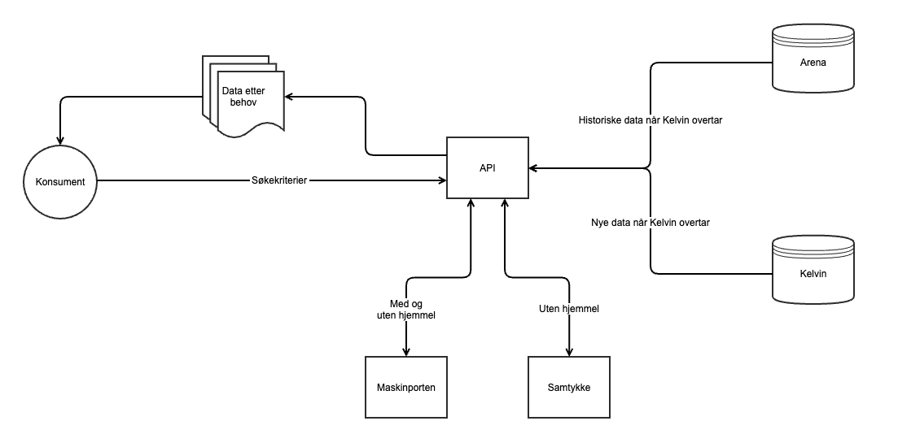

# API for AAP-data
AAP-API tilbyr AAP-data til eksterne konsumenter som enten har hjemmel til å hente AAP-data eller et samtykke fra bruker. Denne versjonen av API’et eksponerer kun et REST-endepunkt der konsumentene kan hente data.

API’et henter data fra 2 kilder
- Arena – det eksisterende saksbehandlingsverktøyet Nav bruker til å behandle AAP-saker
- Kelvin – nytt saksbehandlingsverktøy som ble innført i 2025

Interndokumentasjon for datadeling fra AAP kan finnes på [aap-sysdoc](https://aap-sysdoc.ansatt.nav.no/funksjonalitet/Datadeling/funksjonell).

## URL som benyttes

Base-URL for AAP-API er:

- For test: https://aap-api.ekstern.dev.nav.no/
- For prod: https://aap-api.nav.no/

## Beskrivelse av uttrekk

Beskrivelse av uttrekk kan finnes på vår [Swagger dokumentasjon](https://aap-api.ekstern.dev.nav.no/swagger).

## Tilgang

Tilgangen til AAP-API oppnås på to måter:
- Maskinporten
- Samtykke

### Tilgang med maskinporten

Konsumenter som har hjemmel til å hente AAP-data fra Nav trenger kun å benytte seg av et token utstedt av maskinporten.

For å bruke et Maskinporten-token må konsumenten ta kontakt med Nav og få registrert sitt organisasjonsnummer. Konsumenten får da tilgang til et scope.

Deretter må konsument registrere seg hos Digdir med det scope de har fått tilgang til. Detaljert beskrivelse om maskinporten finnes [på denne lenken](https://samarbeid.digdir.no/maskinporten/ta-i-bruk-maskinporten/97).

Nav har laget et [kodeeksempel](https://github.com/navikt/aap-test-token-provider/blob/main/app/main/tokenprovider/makinporten/MaskinportenTokenProvider.kt) for å utstede et test-token for Maskinporten.

### Kodeendringer for hver ny konsument

 - [ ] Oppdater NAIS-filene `app-dev.yml` og `app-prod.yml` med navn og org.nr for de nye konsumentene.
 - [ ] Oppdater `Consumers.kt` og referer til riktig behandlingsgrunnlag i `behandlingsgrunnlag`-feltet.

### Tilgang med samtykke
Konsumenter som ikke har hjemmel til å hente AAP-data trenger samtykke fra personen man ønsker å hente data for. Dette tokenet må brukes sammen med Maskinporten-token. Samtykke-token må derfor legges inn i header på request som Nav-Samtykke-Token.

Samtykke er beskrevet [på Altinn sine sider](https://altinn.github.io/docs/utviklingsguider/samtykke/).

